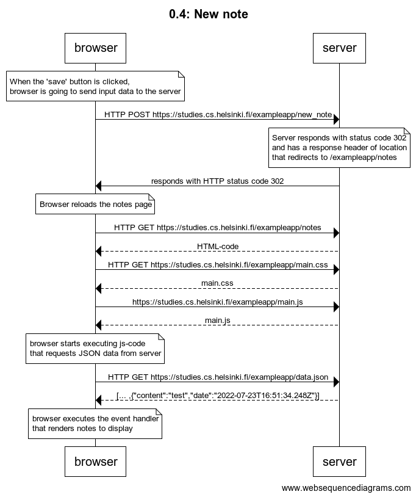
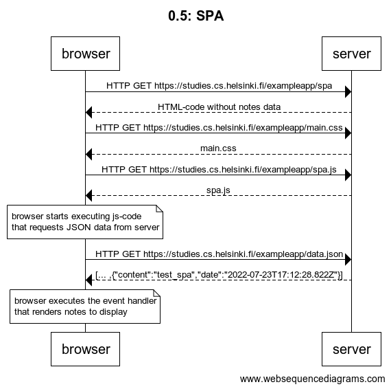
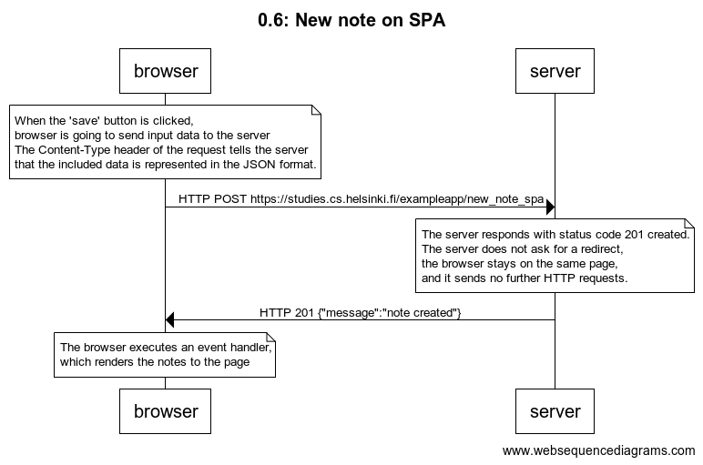

# [Fundamentals of Web apps](https://fullstackopen.com/en/part0/fundamentals_of_web_apps)

## Exercises 0.1 - 0.6

## 0.1: HTML

Review the basics of HTML by reading this tutorial from Mozilla : [HTML tutorial](https://developer.mozilla.org/en-US/docs/Learn/Getting_started_with_the_web/HTML_basics).

## 0.2: CSS

Review the basics of CSS by reading this tutorial from Mozilla: [CSS tutorial](https://developer.mozilla.org/en-US/docs/Learn/Getting_started_with_the_web/CSS_basics).

## 0.3: HTML forms

Learn about the basics of HTML forms by reading Mozilla's tutorial [Your first form](https://developer.mozilla.org/en-US/docs/Learn/Forms/Your_first_form).

## 0.4: New note

Create a similar diagram depicting the situation where the user creates a new note on page <https://studies.cs.helsinki.fi/exampleapp/notes> when writing something into the text field and clicking the submit button.

### 0.4 Solution



By <https://www.websequencediagrams.com/>

```plaintext
title 0.4: New note

note over browser:
When the 'save' button is clicked,
browser is going to send input data to the server
end note
browser->server: HTTP POST https://studies.cs.helsinki.fi/exampleapp/new_note
note over server:
Server responds with status code 302
and has a response header of location
that redirects to /exampleapp/notes
end note
server->browser: responds with HTTP status code 302
note over browser:
Browser reloads the notes page
end note
browser->server: HTTP GET https://studies.cs.helsinki.fi/exampleapp/notes
server-->browser: HTML-code
browser->server: HTTP GET https://studies.cs.helsinki.fi/exampleapp/main.css
server-->browser: main.css
browser->server: https://studies.cs.helsinki.fi/exampleapp/main.js
server-->browser: main.js

note over browser:
browser starts executing js-code
that requests JSON data from server
end note

browser->server: HTTP GET https://studies.cs.helsinki.fi/exampleapp/data.json
server-->browser: [... ,{"content":"test","date":"2022-07-23T16:51:34.248Z"}]

note over browser:
browser executes the event handler
that renders notes to display
end note
```

## 0.5: Single page app

Create a diagram depicting the situation where the user goes to the single page app version of the notes app at <https://studies.cs.helsinki.fi/exampleapp/spa>.

### 0.5 Solution



By <https://www.websequencediagrams.com/>

```plaintext
title 0.5: SPA

browser->server: HTTP GET https://studies.cs.helsinki.fi/exampleapp/spa
server-->browser: HTML-code without notes data
browser->server: HTTP GET https://studies.cs.helsinki.fi/exampleapp/main.css
server-->browser: main.css
browser->server: HTTP GET https://studies.cs.helsinki.fi/exampleapp/spa.js
server-->browser: spa.js

note over browser:
browser starts executing js-code
that requests JSON data from server
end note

browser->server: HTTP GET https://studies.cs.helsinki.fi/exampleapp/data.json
server-->browser: [... ,{"content":"test_spa","date":"2022-07-23T17:12:28.822Z"}]

note over browser:
browser executes the event handler
that renders notes to display
end note
```

## 0.6: New note

Create a diagram depicting the situation where the user creates a new note using the single page version of the app.

### 0.6 Solution



By <https://www.websequencediagrams.com/>

```plaintext
title 0.6: New note on SPA

note over browser:
When the 'save' button is clicked,
browser is going to send input data to the server
The Content-Type header of the request tells the server
that the included data is represented in the JSON format.
end note
browser->server: HTTP POST https://studies.cs.helsinki.fi/exampleapp/new_note_spa
note over server:
The server responds with status code 201 created.
The server does not ask for a redirect,
the browser stays on the same page,
and it sends no further HTTP requests.
end note
server->browser: HTTP 201 {"message":"note created"}
note over browser:
The browser executes an event handler,
which renders the notes to the page
end note
```
